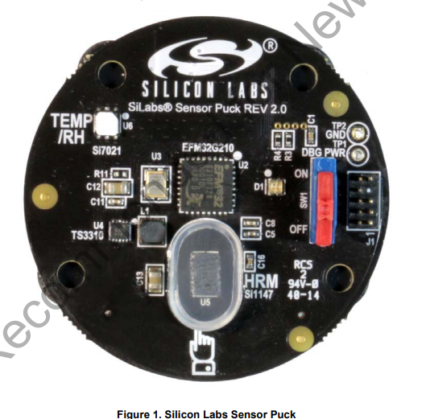

# vscp-python-sensorpuck



VSCP Python interface to (Silicon Labs Sensorpuck)[https://www.silabs.com/documents/public/user-guides/Sensor_Puck_UG.pdf]. 
This is an old thing I got in the past but still useful and at least I have a hard time trowing working things in the bin so I
decided to put it to work.

The software will scan Bluetooth BLE for a sensorpuck, if one is found it will read the data from it and send this data to a 
VSCP daemon over the servers tcp/ip interface. The collected data is signal strength, realtive humidity, temperature, ambient light, 
UV index and battery voltage. All of these values will be sent as relavant events.

This sensor is live on the VSCP [demo server](https://github.com/grodansparadis/vscp/wiki/Demo) so you can see and interact with live 
data sent from it. See [wiki pi4](https://github.com/grodansparadis/vscp/wiki/pi4). Subscribe to the **demo.vscp.org** server on port 
**1883** using "_vscp_" as username and "_secret_" as pasword. You can also connect to this server over websockets using port **9001**.

If you subscribe to 

```bash
vscp/FF:FF:FF:FF:FF:FF:FF:F7:D4:81:CA:E1:4A:AA:00:00/#
```

you will get sensor values received form  as sensorpuck installed in our server room.


## Setting up

The code is written for and tested with Python3 but will probably work on older Pythons as well.

Here we describe how to setup a working system on a Raspberry Pi but the described steps should work on any Debian derived distribution.
You need a Linux machine with a BLE interface of course. And you obviosly need a sensorpuck. 

### Install Bluetooth support

```bash
sudo apt install bluez
```

### Install the VSCP helper library

The latest version is prefered

```bash
wget https://github.com/grodansparadis/vscp-helper-lib/releases/download/v15.0.0/libvscphelper_15.0.0_armhf.deb
sudo apt install ./libvscphelper_15.0.0_armhf.deb
```

old version may be need for old python code

```bash
wget https://github.com/grodansparadis/vscp-helper-lib/releases/download/v14.0.2/libvscphelper14_14.0.2-1_armhf.deb
sudo apt install ./libvscphelper14_14.0.2-1_armhf.deb

wget https://github.com/grodansparadis/vscp-helper-lib/releases/download/v14.0.2/libvscphelper14-dev_14.0.2-1_armhf.deb
sudo apt install ./libvscphelper14-dev_14.0.2-1_armhf.deb
```

### Install Python3 BLE support

```bash
sudo pip3 install bluepy
sudo pip3 install pyble
``

### Install Python VSCP support

```bash
sudo pip3 install pyvscp
sudo pip3 install pyvscpclasses
sudo pip3 install pyvscptypes
sudo pip3 install pyvscphelper
```

## Configure

Edit the beginning of the _vscp_sensorpuck.py_ file where the VSCP_HOST etc are located and enter the values for your own setup.

## Test

Run 

```bash
sudo python3 vscp_sensorpuck.py
```

and you sensopuck should be found and data be collected.

Do

```bash
chmod a+x vscp_sensorpuck.py
```

to make the file executable on it's own.


