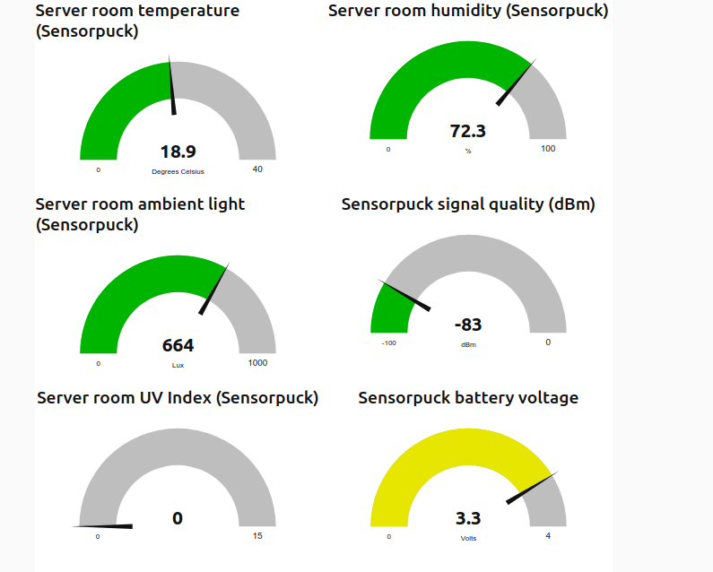

# vscp-python-sensorpuck


VSCP Python interface to (Silicon Labs Sensorpuck)[https://www.silabs.com/documents/public/user-guides/Sensor_Puck_UG.pdf]. 
This is an old thing I got in the past but still useful and at least I have a hard time trowing working things in the bin 
so I decided to put it to work.

The software will scan Bluetooth BLE for a sensorpuck, if one is found it will read the data from it and send this data to a 
VSCP daemon over the servers tcp/ip interface. The collected data is signal strength, relative humidity, temperature, 
ambient light, UV index and battery voltage. All of these values will be sent as relevant events.

This sensor is live on the VSCP [demo server](https://github.com/grodansparadis/vscp/wiki/Demo) so you can see and interact with live data sent from it. See [wiki pi4](https://github.com/grodansparadis/vscp/wiki/pi4). Subscribe to 
the **demo.vscp.org** server on port 
**1883** using "_vscp_" as username and "_secret_" as password. You can also connect to this server over websocket 
using port **9001**.

If you subscribe to 

```bash
vscp/FF:FF:FF:FF:FF:FF:FF:F7:D4:81:CA:E1:4A:AA:00:00/#
```

you will get live sensor data form a sensorpuck installed in our office server room.


## Setting up

The code is written for and tested with Python3 but will probably work on older Pythons as well.

Here we describe how to setup a working system on a Raspberry Pi but the described steps should work on any 
Debian derived distribution. You need a Linux machine with a BLE interface of course. And you obviously need a sensorpuck. 

### Install Bluetooth support

```bash
sudo apt install bluez
```

### Install the VSCP helper library

The latest version is preferred

```bash
wget https://github.com/grodansparadis/vscp-helper-lib/releases/download/v15.0.0/libvscphelper_15.0.0_armhf.deb
sudo apt install ./libvscphelper_15.0.0_armhf.deb
```

old version may be need for old python code

```bash
wget https://github.com/grodansparadis/vscp-helper-lib/releases/download/v14.0.2/libvscphelper14_14.0.2-1_armhf.deb
sudo apt install ./libvscphelper14_14.0.2-1_armhf.deb

wget https://github.com/grodansparadis/vscp-helper-lib/releases/download/v14.0.2/libvscphelper14-dev_14.0.2-1_armhf.deb
sudo apt install ./libvscphelper14-dev_14.0.2-1_armhf.deb
```

### Install Python3 BLE support

```bash
sudo pip3 install bluepy
sudo pip3 install pyble
``

### Install Python VSCP support

```bash
sudo pip3 install pyvscp
sudo pip3 install pyvscpclasses
sudo pip3 install pyvscptypes
sudo pip3 install pyvscphelper
```

## Configure

Edit the beginning of the _vscp_sensorpuck.py_ file where the VSCP_HOST etc are located and enter the values for your own setup.

## Test

Run 

```bash
sudo python3 vscp_sensorpuck.py
```

and you sensorpuck should be found and data be collected.

Do

```bash
chmod a+x vscp_sensorpuck.py
```

to make the file executable on it's own.

## Demo



Below is a sample node red flow that can be used to test the output from the VSCP demo server.  You need to set up credentials for the MQTT connections to

```
host: demo.vscp.org
port: 1883
User: vscp
Password: secret
```

also test.mosquitto.org can be used. 

```json

```
[{"id":"56d7a301a73f4880","type":"mqtt in","z":"a2aa7db6f1f755c2","name":"Sensorpuck: Server room temperature","topic":"vscp/FF:FF:FF:FF:FF:FF:FF:F7:D4:81:CA:E1:4A:AA:00:01/1040/6/#","qos":"2","datatype":"json","broker":"5438645a.6577cc","nl":false,"rap":true,"rh":0,"x":170,"y":100,"wires":[["2eeb02228ba6864f"]]},{"id":"019734e75fe8bf9a","type":"ui_gauge","z":"a2aa7db6f1f755c2","name":"Sensorpuck temperature","group":"79caa5d387ac96f5","order":1,"width":"6","height":"4","gtype":"gage","title":"Server room temperature (Sensorpuck)","label":"Degrees Celsius","format":"{{value}}","min":0,"max":"40","colors":["#00b500","#e6e600","#ca3838"],"seg1":"30","seg2":"35","x":810,"y":100,"wires":[]},{"id":"ab69bd3f3dd5f16f","type":"debug","z":"a2aa7db6f1f755c2","name":"","active":false,"tosidebar":true,"console":false,"tostatus":false,"complete":"false","statusVal":"","statusType":"auto","x":610,"y":180,"wires":[]},{"id":"cdd03bfdf3cf2c60","type":"function","z":"a2aa7db6f1f755c2","name":"","func":"msg.value = msg.payload.measurement.value;\nreturn msg;","outputs":1,"noerr":0,"initialize":"","finalize":"","libs":[],"x":600,"y":100,"wires":[["019734e75fe8bf9a"]]},{"id":"d5939ea6318ffd1a","type":"function","z":"a2aa7db6f1f755c2","name":"","func":"msg.payload = msg.payload.measurement.value;\nreturn msg;","outputs":1,"noerr":0,"initialize":"","finalize":"","libs":[],"x":600,"y":140,"wires":[["3c76688f3442832a"]]},{"id":"3c76688f3442832a","type":"ui_chart","z":"a2aa7db6f1f755c2","name":"Sensorpuck temperature","group":"79caa5d387ac96f5","order":5,"width":"11","height":"5","label":"Server room temperature (Sensorpuck)","chartType":"line","legend":"false","xformat":"HH:mm","interpolate":"linear","nodata":"No data","dot":false,"ymin":"0","ymax":"40","removeOlder":"12","removeOlderPoints":"","removeOlderUnit":"3600","cutout":0,"useOneColor":false,"useUTC":false,"colors":["#1d6faa","#aec7e8","#ff7f0e","#2ca02c","#98df8a","#d62728","#ff9896","#9467bd","#c5b0d5"],"outputs":1,"useDifferentColor":false,"x":810,"y":140,"wires":[[]]},{"id":"2eeb02228ba6864f","type":"event2value","z":"a2aa7db6f1f755c2","name":"","btransparent":true,"btopayload":true,"bvalue2payload":false,"x":430,"y":100,"wires":[["cdd03bfdf3cf2c60","d5939ea6318ffd1a","ab69bd3f3dd5f16f"]]},{"id":"e39a020a237f21d1","type":"mqtt in","z":"a2aa7db6f1f755c2","name":"Sensorpuck: Server room humidity","topic":"vscp/FF:FF:FF:FF:FF:FF:FF:F7:D4:81:CA:E1:4A:AA:00:02/1040/35/2/#","qos":"2","datatype":"json","broker":"5438645a.6577cc","nl":false,"rap":true,"rh":0,"x":160,"y":260,"wires":[["4fbbe0b7e077f793"]]},{"id":"9bf44d0557ad1856","type":"ui_gauge","z":"a2aa7db6f1f755c2","name":"Sensorpuck humidity","group":"79caa5d387ac96f5","order":1,"width":"6","height":"4","gtype":"gage","title":"Server room humidity (Sensorpuck)","label":"%","format":"{{value}}","min":0,"max":"100","colors":["#00b500","#e6e600","#ca3838"],"seg1":"80","seg2":"100","x":800,"y":260,"wires":[]},{"id":"3cb8b8a60a92523e","type":"debug","z":"a2aa7db6f1f755c2","name":"","active":false,"tosidebar":true,"console":false,"tostatus":false,"complete":"false","statusVal":"","statusType":"auto","x":610,"y":340,"wires":[]},{"id":"49b61c0426c30d13","type":"function","z":"a2aa7db6f1f755c2","name":"","func":"msg.value = msg.payload.measurement.value;\nreturn msg;","outputs":1,"noerr":0,"initialize":"","finalize":"","libs":[],"x":600,"y":260,"wires":[["9bf44d0557ad1856"]]},{"id":"100952928fb14389","type":"function","z":"a2aa7db6f1f755c2","name":"","func":"msg.payload = msg.payload.measurement.value;\nreturn msg;","outputs":1,"noerr":0,"initialize":"","finalize":"","libs":[],"x":600,"y":300,"wires":[["f00ec9910d5fad99"]]},{"id":"f00ec9910d5fad99","type":"ui_chart","z":"a2aa7db6f1f755c2","name":"Sensorpuck humidity","group":"79caa5d387ac96f5","order":5,"width":"11","height":"5","label":"Server room humidity (Sensorpuck)","chartType":"line","legend":"false","xformat":"HH:mm","interpolate":"linear","nodata":"No data","dot":false,"ymin":"0","ymax":"100","removeOlder":"12","removeOlderPoints":"","removeOlderUnit":"3600","cutout":0,"useOneColor":false,"useUTC":false,"colors":["#1d6faa","#aec7e8","#ff7f0e","#2ca02c","#98df8a","#d62728","#ff9896","#9467bd","#c5b0d5"],"outputs":1,"useDifferentColor":false,"x":800,"y":300,"wires":[[]]},{"id":"4fbbe0b7e077f793","type":"event2value","z":"a2aa7db6f1f755c2","name":"","btransparent":true,"btopayload":true,"bvalue2payload":false,"x":430,"y":260,"wires":[["49b61c0426c30d13","100952928fb14389","3cb8b8a60a92523e"]]},{"id":"f88af7d7d612b915","type":"comment","z":"a2aa7db6f1f755c2","name":"Temperature","info":"","x":100,"y":60,"wires":[]},{"id":"47981ecdeddbcb78","type":"comment","z":"a2aa7db6f1f755c2","name":"Humidity","info":"","x":80,"y":220,"wires":[]},{"id":"5394fa8f60bb3f76","type":"mqtt in","z":"a2aa7db6f1f755c2","name":"Sensorpuck: Server room ambient light","topic":"vscp/FF:FF:FF:FF:FF:FF:FF:F7:D4:81:CA:E1:4A:AA:00:03/1040/25/3/#","qos":"2","datatype":"json","broker":"5438645a.6577cc","nl":false,"rap":true,"rh":0,"x":170,"y":420,"wires":[["ece9566c89e8ee11"]]},{"id":"d13ca59a151c8724","type":"ui_gauge","z":"a2aa7db6f1f755c2","name":"Sensorpuck ambient light","group":"79caa5d387ac96f5","order":1,"width":"6","height":"4","gtype":"gage","title":"Server room ambient light (Sensorpuck)","label":"Lux","format":"{{value}}","min":0,"max":"3000","colors":["#00b500","#e6e600","#ca3838"],"seg1":"1000","seg2":"3000","x":810,"y":420,"wires":[]},{"id":"1b6904a4d007e9f2","type":"debug","z":"a2aa7db6f1f755c2","name":"","active":false,"tosidebar":true,"console":false,"tostatus":false,"complete":"false","statusVal":"","statusType":"auto","x":610,"y":500,"wires":[]},{"id":"b55d6d9f350b45fd","type":"function","z":"a2aa7db6f1f755c2","name":"","func":"msg.value = msg.payload.measurement.value;\nreturn msg;","outputs":1,"noerr":0,"initialize":"","finalize":"","libs":[],"x":600,"y":420,"wires":[["d13ca59a151c8724"]]},{"id":"c2ba3c2306a9cbae","type":"ui_chart","z":"a2aa7db6f1f755c2","name":"Sensorpuck ambient light","group":"79caa5d387ac96f5","order":5,"width":"11","height":"5","label":"Server room ambient light (Sensorpuck)","chartType":"line","legend":"false","xformat":"HH:mm","interpolate":"linear","nodata":"No data","dot":false,"ymin":"0","ymax":"3000","removeOlder":"12","removeOlderPoints":"","removeOlderUnit":"3600","cutout":0,"useOneColor":false,"useUTC":false,"colors":["#1d6faa","#aec7e8","#ff7f0e","#2ca02c","#98df8a","#d62728","#ff9896","#9467bd","#c5b0d5"],"outputs":1,"useDifferentColor":false,"x":810,"y":460,"wires":[[]]},{"id":"ece9566c89e8ee11","type":"event2value","z":"a2aa7db6f1f755c2","name":"","btransparent":true,"btopayload":true,"bvalue2payload":false,"x":430,"y":420,"wires":[["b55d6d9f350b45fd","1b6904a4d007e9f2","1c43c3fd3f192a76"]]},{"id":"a6a54e2b1d4b179e","type":"comment","z":"a2aa7db6f1f755c2","name":"Ambient light","info":"","x":90,"y":380,"wires":[]},{"id":"eb4099abb3ef16c6","type":"mqtt in","z":"a2aa7db6f1f755c2","name":"Sensorpuck: Sensorpuck signal quality","topic":"vscp/FF:FF:FF:FF:FF:FF:FF:F7:D4:81:CA:E1:4A:AA:00:08/15/6/8/#","qos":"2","datatype":"json","broker":"5438645a.6577cc","nl":false,"rap":true,"rh":0,"x":170,"y":740,"wires":[["9e2b543425619c12","89f938a857c4efbc","8f80212d128d209d"]]},{"id":"026755ee60723d5b","type":"ui_gauge","z":"a2aa7db6f1f755c2","name":"Sensorpuck signal quality","group":"79caa5d387ac96f5","order":1,"width":"6","height":"4","gtype":"gage","title":"Sensorpuck signal strength (dBm)","label":"dBm","format":"{{value}}","min":"-110","max":"0","colors":["#00b500","#e6e600","#ca3838"],"seg1":"-75","seg2":"0","x":810,"y":740,"wires":[]},{"id":"8f80212d128d209d","type":"debug","z":"a2aa7db6f1f755c2","name":"","active":false,"tosidebar":true,"console":false,"tostatus":false,"complete":"true","targetType":"full","statusVal":"","statusType":"auto","x":590,"y":820,"wires":[]},{"id":"9e2b543425619c12","type":"function","z":"a2aa7db6f1f755c2","name":"","func":"// First byte should be 0x70\n// Data coding 0b011 = integer\n// Unit = 2 = dBm\nmsg.value = 0;\nif ((msg.payload.vscpData.length == 2) && (msg.payload.vscpData[0] == 0x70) ) {\n    msg.value = msg.payload.vscpData[1];\n    if (msg.value > 0x80) {\n        msg.value = 0 - ((~msg.value & 0xff) + 1);                \n    }\n}\nreturn msg;","outputs":1,"noerr":0,"initialize":"","finalize":"","libs":[],"x":600,"y":740,"wires":[["026755ee60723d5b","efd181b153054067"]]},{"id":"89f938a857c4efbc","type":"function","z":"a2aa7db6f1f755c2","name":"","func":"// First byte should be 0x70\n// Data coding 0b011 = integer\n// Unit = 2 = dBm\n\nif ((msg.payload.vscpData.length == 2) && (msg.payload.vscpData[0] == 0x70) ) {\n    msg.payload = msg.payload.vscpData[1];\n    if (msg.payload > 0x80) {\n        msg.payload = 0 - ((~msg.payload & 0xff) + 1);                \n    }\n}\nelse {\n    msg.payload = 0;\n}\nreturn msg;","outputs":1,"noerr":0,"initialize":"","finalize":"","libs":[],"x":600,"y":780,"wires":[["f639bfd28ba19b8f"]]},{"id":"f639bfd28ba19b8f","type":"ui_chart","z":"a2aa7db6f1f755c2","name":"Sensorpuck signal quality","group":"79caa5d387ac96f5","order":5,"width":"11","height":"5","label":"Sensorpuck signal strength","chartType":"line","legend":"false","xformat":"HH:mm","interpolate":"linear","nodata":"No data","dot":false,"ymin":"-100","ymax":"0","removeOlder":"12","removeOlderPoints":"","removeOlderUnit":"3600","cutout":0,"useOneColor":false,"useUTC":false,"colors":["#1d6faa","#aec7e8","#ff7f0e","#2ca02c","#98df8a","#d62728","#ff9896","#9467bd","#c5b0d5"],"outputs":1,"useDifferentColor":false,"x":810,"y":780,"wires":[[]]},{"id":"dea44967cbd3ca85","type":"comment","z":"a2aa7db6f1f755c2","name":"Signal strength","info":"","x":100,"y":700,"wires":[]},{"id":"3a2767b8e6c41daf","type":"mqtt in","z":"a2aa7db6f1f755c2","name":"Sensorpuck: Server room UV Index","topic":"vscp/FF:FF:FF:FF:FF:FF:FF:F7:D4:81:CA:E1:4A:AA:00:04/90/52/4/#","qos":"2","datatype":"json","broker":"5438645a.6577cc","nl":false,"rap":true,"rh":0,"x":160,"y":580,"wires":[["a6bbdd9cc82f143e","b80ac2b4f37b1c87","3d6ffb559ca72c99"]]},{"id":"7866bce5a09bda7d","type":"ui_gauge","z":"a2aa7db6f1f755c2","name":"Sensorpuck UV Index","group":"79caa5d387ac96f5","order":1,"width":"6","height":"4","gtype":"gage","title":"Server room UV Index (Sensorpuck)","label":"","format":"{{value}}","min":0,"max":"15","colors":["#00b500","#e6e600","#ca3838"],"seg1":"4","seg2":"15","x":800,"y":580,"wires":[]},{"id":"3d6ffb559ca72c99","type":"debug","z":"a2aa7db6f1f755c2","name":"","active":false,"tosidebar":true,"console":false,"tostatus":false,"complete":"payload","targetType":"msg","statusVal":"","statusType":"auto","x":610,"y":660,"wires":[]},{"id":"a6bbdd9cc82f143e","type":"function","z":"a2aa7db6f1f755c2","name":"","func":"msg.value = msg.payload.vscpData[2];\nreturn msg;","outputs":1,"noerr":0,"initialize":"","finalize":"","libs":[],"x":600,"y":580,"wires":[["7866bce5a09bda7d","d680984d5ffa11d7"]]},{"id":"b80ac2b4f37b1c87","type":"function","z":"a2aa7db6f1f755c2","name":"","func":"msg.payload = msg.payload.vscpData[2];\nreturn msg;","outputs":1,"noerr":0,"initialize":"","finalize":"","libs":[],"x":600,"y":620,"wires":[["5d72160d32beb596"]]},{"id":"5d72160d32beb596","type":"ui_chart","z":"a2aa7db6f1f755c2","name":"Sensorpuck UV Index","group":"79caa5d387ac96f5","order":5,"width":"11","height":"5","label":"Server room UV Index (Sensorpuck)","chartType":"line","legend":"false","xformat":"HH:mm","interpolate":"linear","nodata":"No data","dot":false,"ymin":"0","ymax":"15","removeOlder":"12","removeOlderPoints":"","removeOlderUnit":"3600","cutout":0,"useOneColor":false,"useUTC":false,"colors":["#1d6faa","#aec7e8","#ff7f0e","#2ca02c","#98df8a","#d62728","#ff9896","#9467bd","#c5b0d5"],"outputs":1,"useDifferentColor":false,"x":800,"y":620,"wires":[[]]},{"id":"6e2925d8fad61c23","type":"comment","z":"a2aa7db6f1f755c2","name":"UV Index","info":"","x":80,"y":540,"wires":[]},{"id":"7ca7c4bbc84d3baf","type":"mqtt in","z":"a2aa7db6f1f755c2","name":"Sensorpuck: Sensorpuck battery voltage","topic":"vscp/FF:FF:FF:FF:FF:FF:FF:F7:D4:81:CA:E1:4A:AA:00:05/1040/16/5/#","qos":"2","datatype":"json","broker":"5438645a.6577cc","nl":false,"rap":true,"rh":0,"x":180,"y":900,"wires":[["1636123191b6a6ac"]]},{"id":"fe392f5c21d98daa","type":"ui_gauge","z":"a2aa7db6f1f755c2","name":"Sensorpuck battery voltage","group":"79caa5d387ac96f5","order":1,"width":"6","height":"4","gtype":"gage","title":"Sensorpuck battery voltage","label":"Volts","format":"{{value}}","min":0,"max":"4","colors":["#00b500","#e6e600","#ca3838"],"seg1":"2.4","seg2":"4","x":820,"y":900,"wires":[]},{"id":"9a5ac959b31ffee2","type":"debug","z":"a2aa7db6f1f755c2","name":"","active":false,"tosidebar":true,"console":false,"tostatus":false,"complete":"false","statusVal":"","statusType":"auto","x":610,"y":980,"wires":[]},{"id":"7f9da96db5566ba3","type":"function","z":"a2aa7db6f1f755c2","name":"","func":"msg.value = msg.payload.measurement.value;\nreturn msg;","outputs":1,"noerr":0,"initialize":"","finalize":"","libs":[],"x":600,"y":900,"wires":[["fe392f5c21d98daa"]]},{"id":"635261f7c21944d1","type":"function","z":"a2aa7db6f1f755c2","name":"","func":"msg.payload = msg.payload.measurement.value;\nreturn msg;","outputs":1,"noerr":0,"initialize":"","finalize":"","libs":[],"x":600,"y":940,"wires":[["044e564df0e17f3f"]]},{"id":"044e564df0e17f3f","type":"ui_chart","z":"a2aa7db6f1f755c2","name":"Sensorpuck battery voltage","group":"79caa5d387ac96f5","order":5,"width":"11","height":"5","label":"Sensorpuck battery voltage","chartType":"line","legend":"false","xformat":"HH:mm","interpolate":"linear","nodata":"No data","dot":false,"ymin":"0","ymax":"4","removeOlder":"12","removeOlderPoints":"","removeOlderUnit":"3600","cutout":0,"useOneColor":false,"useUTC":false,"colors":["#1d6faa","#aec7e8","#ff7f0e","#2ca02c","#98df8a","#d62728","#ff9896","#9467bd","#c5b0d5"],"outputs":1,"useDifferentColor":false,"x":820,"y":940,"wires":[[]]},{"id":"1636123191b6a6ac","type":"event2value","z":"a2aa7db6f1f755c2","name":"","btransparent":true,"btopayload":true,"bvalue2payload":false,"x":430,"y":900,"wires":[["7f9da96db5566ba3","635261f7c21944d1","9a5ac959b31ffee2"]]},{"id":"1cdd609c1723dac5","type":"comment","z":"a2aa7db6f1f755c2","name":"Battery Voltage","info":"","x":100,"y":860,"wires":[]},{"id":"efd181b153054067","type":"debug","z":"a2aa7db6f1f755c2","name":"","active":false,"tosidebar":true,"console":false,"tostatus":false,"complete":"true","targetType":"full","statusVal":"","statusType":"auto","x":750,"y":820,"wires":[]},{"id":"1c43c3fd3f192a76","type":"function","z":"a2aa7db6f1f755c2","name":"","func":"msg.payload = msg.payload.measurement.value;\nreturn msg;","outputs":1,"noerr":0,"initialize":"","finalize":"","libs":[],"x":600,"y":460,"wires":[["c2ba3c2306a9cbae"]]},{"id":"d680984d5ffa11d7","type":"debug","z":"a2aa7db6f1f755c2","name":"","active":false,"tosidebar":true,"console":false,"tostatus":false,"complete":"true","targetType":"full","statusVal":"","statusType":"auto","x":750,"y":540,"wires":[]},{"id":"5438645a.6577cc","type":"mqtt-broker","name":"Local","broker":"localhost","port":"1883","clientid":"lynx","usetls":false,"compatmode":false,"protocolVersion":"4","keepalive":"60","cleansession":true,"birthTopic":"","birthQos":"0","birthPayload":"","birthMsg":{},"closeTopic":"","closeQos":"0","closePayload":"","closeMsg":{},"willTopic":"","willQos":"0","willPayload":"","willMsg":{},"sessionExpiry":""},{"id":"79caa5d387ac96f5","type":"ui_group","name":"Sensorpuck","tab":"19d0b354482d7d92","order":1,"disp":true,"width":"12","collapse":false},{"id":"19d0b354482d7d92","type":"ui_tab","name":"Sensorpuck","icon":"dashboard","disabled":false,"hidden":false}]
----

This file is part of the (VSCP project)[https://vscp.org].
Copyright © 2000-2021 Ake Hedman, the VSCP project - MIT license.